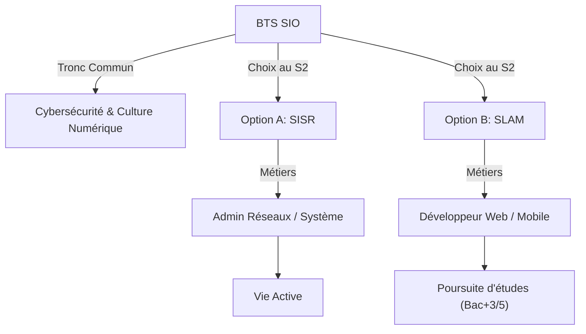

# Le BTS SIO (Services Informatiques aux Organisations)

Le **BTS SIO** est un diplôme d'État de niveau Bac+2 qui forme des experts capables de gérer l'infrastructure informatique d'une entreprise ou de développer des applications logicielles. Il répond aux besoins actuels de **transformation numérique** et de **cybersécurité**.

---

## ⚖️ Les 2 Options de Spécialisation

Au cours de la première année, les étudiants choisissent leur voie :

| Caractéristique | Option A : **SISR** | Option B : **SLAM** (Ma spécialité) |
| :--- | :--- | :--- |
| **Signification** | Solutions d'Infrastructure, Systèmes et Réseaux | **Solutions Logicielles et Applications Métiers** |
| **Focus** | "Matériel & Réseau" | **"Code & Développement"** |
| **Missions** | Gérer les serveurs, le réseau, la sécurité, les comptes utilisateurs. | Créer des logiciels, sites web, applications mobiles, bases de données. |
| **Métiers** | Administrateur réseaux, Technicien système. | Développeur Web/Mobile, Analyste programmeur, DevOps. |

> **Note :** Les deux options partagent un tronc commun fort en **Cybersécurité**, gestion de projet et culture juridique du numérique.

---

## 📚 Le Programme

La formation offre un équilibre entre technique et culture générale :

### Enseignements Techniques
*   **Support & Maintenance** : Gestion du patrimoine informatique.
*   **Cybersécurité** : Protection des données et des services.
*   **Programmation & Base de données** : Algorithmique, SQL, langages objets.
*   **Projets** : Ateliers de professionnalisation en équipe.

### Enseignements Généraux
*   **Culture Générale & Expression**
*   **Anglais Technique**
*   **Mathématiques pour l'informatique**
*   **CEJM** (Culture Économique, Juridique et Managériale)

---

## 💼 Professionnalisation

Le BTS SIO prépare directement au monde du travail via :
*   **Stages** : 10 à 11 semaines en entreprise.
*   **Alternance** : Rythme école/entreprise pour une immersion totale.

---

## 🚀 Poursuites d'études

Après le BTS, les débouchés académiques sont nombreux :
*   **Licence Professionnelle** (Bac+3)
*   **Bachelor Informatique** (Concepteur Développeur d'Applications...)
*   **École d'Ingénieurs**
*   **MIAGE** (Master universitaire)
