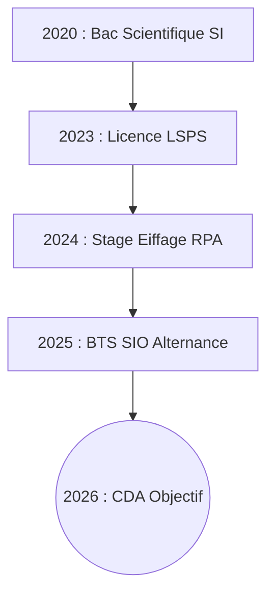

# Profil Professionnel - Alves Fernandes Victor

> **Concepteur Développeur d'Application | Spécialiste Data & IA**  
> 24 ans | Pantin (93500) | Permis B

## À Propos
Etudiant motivé et ponctuel, capable de m'adapter rapidement aux situations. Passionné par les technologies et disposant d'une bonne capacité d'analyse pour résoudre des problèmes complexes. Mon objectif est de devenir un expert en développement d'applications et automatisation pour concevoir des solutions innovantes.

---

## 📞 Contact
- **Téléphone :** 06 60 51 61 73
- **Email :** alvesfernandes594@gmail.com
- **Adresse :** 3 rue Charles Auray, 93500 Pantin

---

## 🛠 Compétences

### Développement
- **Langages :** HTML5, CSS3, JavaScript (ES6+), Python, PHP, Java, SQL, C#.
- **Web :** WordPress, Shopify.
- **Data & IA :** Modélisation de données (Merise/UML), RPA (Automation Anywhere), Machine Learning basics.

### Outils & Logiciels
- **IDE :** Visual Studio Code, Visual Studio, Eclipse.
- **Environnement :** WampServer, XAMPP, Linux, VMware.
- **Conception :** JMerise, StarUML.

### Savoir-être
- Travail en équipe
- Esprit d'analyse
- Autonomie
- Adaptabilité

---

## 💼 Expérience Professionnelle

### **Alternant - Maintenance Légère** | Eiffage Globale Service
*Septembre 2024 - Présent | Vélizy-Villacoublay (78)*
- Maintenance légère des systèmes informatiques.
- Support technique utilisateur et gestion des incidents IT.
- Configuration et déploiement de solutions IT.

### **Technicien Informatique (Saisonnier)** | Mairie de Pantin
*Juin 2024 - Juillet 2024 | Pantin (93)*
- Support technique et maintenance du parc informatique.

### **Stage - Support Développeur RPA** | Eiffage
*Février 2024 - Avril 2024 (3 mois) | Neuilly-Sur-Marne (93)*
- Création de bots avec **Automation Anywhere**.
- Analyse de processus métier et documentation.
- Maintenance des processus automatisés.

### **Employé Administratif (CDD)** | APGIS
*Septembre 2023 | Vincennes (94)*

### **Support Chef de Projet (Stage)** | Haute Autorité de Santé
*Novembre 2022 - Janvier 2023 | Saint-Denis (93)*

---

## 🎓 Formation

### **Concepteur Développeur d'Applications** (Bac+3/4)
*2025 - 2026 | CFA INSTA, Paris*
- En cours.

### **BTS SIO - Option SLAM** (Bac+2)
*2023 - 2025 | CFA INSTA, Paris*
- Services Informatiques aux Organisations, option Solutions Logicielles et Applications Métiers.

### **Licence Sciences Pour la Santé (LSPS)**
*2020 - 2023 | UPEC (Paris XII)*
- Acquisition d'une base scientifique solide.

### **Baccalauréat Scientifique (Option SI)**
*2019 - 2020 | Lycées Saint Sulpice & Lucie Aubrac*
- Mention Bien.

---

## 📜 Certifications
- **RPA Automation Anywhere** (Automatisation de processus)
- **SST** (Sauveteur Secouriste du Travail)
