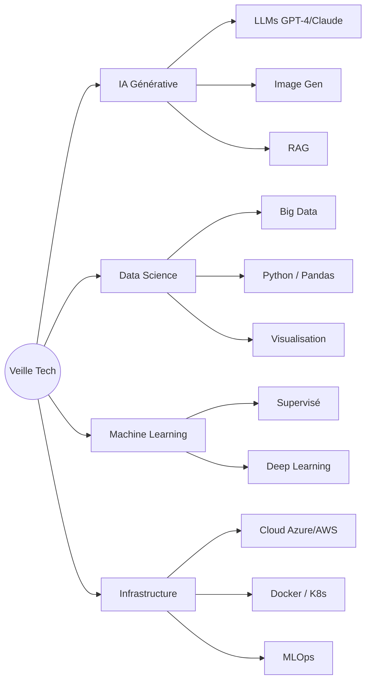

# Veille Technologique : Data & Intelligence Artificielle

> **Dernière mise à jour :** Janvier 2026  
> **Sujet :** Convergence IA & Big Data

## 🎯 Définition & Objectifs

La veille technologique est un processus continu visant à surveiller les évolutions en **Intelligence Artificielle** et **Science des Données**.

**Pourquoi ce sujet ?**
*   Transformation rapide du marché.
*   Compétences clés pour un développeur moderne.
*   Synergie entre "Data" (le carburant) et "IA" (le moteur).

---

## 🔍 Mes Domaines de Veille

### 1. Intelligence Artificielle Générale
*   **Machine Learning (ML)** : Apprentissage supervisé/non-supervisé.
*   **Deep Learning (DL)** : Réseaux de neurones, CNN (Vision), RNN (Séquences).
*   **LLMs (Large Language Models)** : GPT-4, Claude, LLaMA, RAG (Retrieval Augmented Generation).
*   **Computer Vision** : Détection d'objets, analyse vidéo.

### 2. Data Engineering & Science
*   **Big Data** : Spark, Hadoop, NoSQL (MongoDB).
*   **Data Pipelines** : ETL/ELT, Nettoyage, Qualité des données.
*   **Outils** : Python (Pandas, NumPy, Scikit-learn), SQL Avancé.
*   **Visualisation** : Power BI, Tableau, Data Storytelling.

### 3. MLOps & Infrastructure
*   **Déploiement** : Docker, Kubernetes.
*   **Pipeline ML** : Entraînement, Versioning, Monitoring (MLflow).
*   **Cloud** : AWS SageMaker, Azure ML.

### 4. Sécurité & Éthique
*   **IA Responsable** : Biais, explicabilité (XAI).
*   **Régulation** : RGPD, AI Act européen.
*   **Sécurité** : Robustesse des modèles, confidentialité.

---

## 🛠 Outils & Frameworks Suivis

| Catégorie | Outils Clés |
| :--- | :--- |
| **Frameworks ML/DL** | TensorFlow, PyTorch, Keras, Scikit-learn, Hugging Face |
| **Data Outils** | Pandas, Jupyter, Spark, Kafka |
| **Plateformes IA** | OpenAI API, Azure ML, Google Vertex AI |
| **Visualisation** | Tableau, Power BI, Grafana |

---

## 📰 Sources d'Information

**Francophones 🇫🇷**
*   [Developpez.com](https://www.developpez.net/forums/) (Communauté Dev)
*   [Le Monde Informatique](https://lemondeinformatique.fr) (Veille Pro)
*   [Journal du Hacker](https://www.journalduhacker.net) (Tech News)

**Spécialisées IA 🤖**
*   NetApp IA
*   Human Coders News

---

## 💡 Concepts Clés

### Le Pipeline ML Classique
1.  **Data Collection** & Exploratory Data Analysis (EDA)
2.  **Feature Engineering** & Sélection de modèle
3.  **Entraînement** & Tuning des hyperparamètres
4.  **Évaluation** & Déploiement
5.  **Monitoring** continu

### Différence Data vs IA
> "La Data est le carburant (l'essence) et l'IA est le moteur. L'un ne va pas sans l'autre."

*   **Data** : Les faits bruts (Texte, Images, Chiffres). Sert de mémoire et d'entrainement.
*   **IA** : Programme capable de simuler l'intelligence (Prédire, Automatiser, Générer) en apprenant de la Data.
